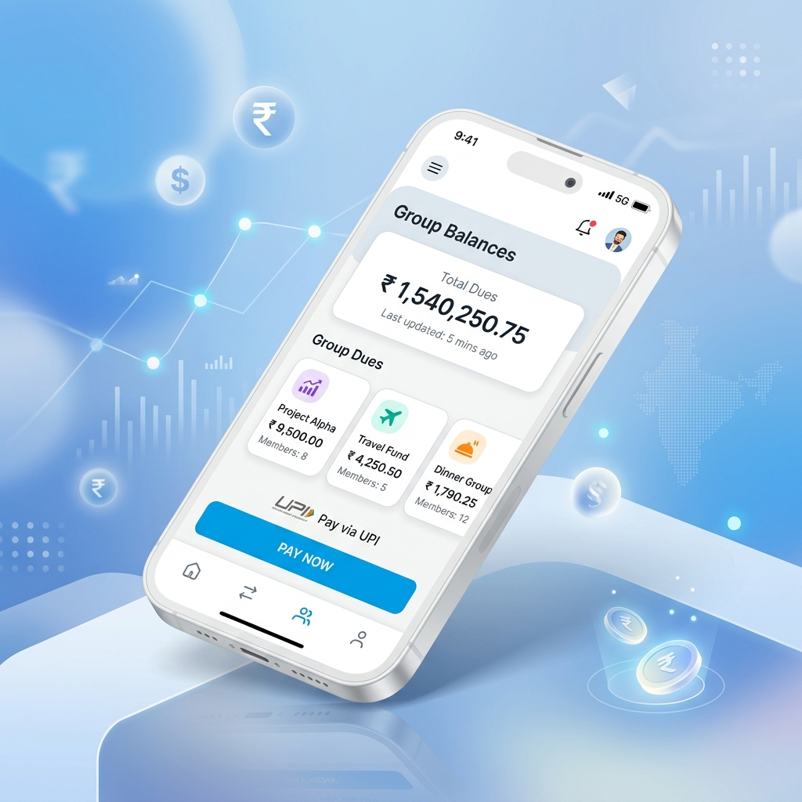

# Bharat Dues: Product Showcase

## 1. The Vision
### "Split Bills, Settle Beautifully."

Bharat Dues is a premium, **UPI-first** expense tracking solution designed for the modern Indian lifestyle. We bridge the gap between complex group spending and effortless digital settlements.

> [!TIP]
> **Key Objective**: Eliminating the "Who owes whom?" awkwardness through algorithmic debt minimization and direct UPI integration.

---

## 2. How It Works
### The Seamless Cycle of Settlement

---

## 3. Core Features (The DNA)

| Feature | Description | Benefit |
| :--- | :--- | :--- |
| **Multi-Mode Splitting** | Equal, %, Shares, or Exact Amount | Flexibilty for every scenario |
| **Greedy Minimizer** | Sophisticated debt reduction algo | Fewer transactions, less hassle |
| **Real-Time Sync** | Firestore event-driven streams | Everyone stays on the same page |
| **Activity Audit** | Detailed "who changed what" log | Absolute transparency & trust |
| **UPI Intent** | Direct deep-linking to Payment Apps | Pay in 2 taps, no manual entry |
| **Smart Approvals** | Instant confirmation for receivers | Frictionless manual payments |

---

## 4. Design Philosophy
### Premium Fintech Aesthetics

The app features a **modern, high-contrast Light Theme** designed for the Indian digital ecosystem:

- **Vibrant Blue Accents** (`#00B9F1`): For clarity and trust.
- **Minimalist Surfaces**: Clean white cards on subtle grey backgrounds.
- **High-Contrast Type**: Optimized for outdoor legibility using Dark Blue (`#002E6E`).
- **Glassmorphic Touches**: For a modern, high-end feel.

---

## 5. How to Use (3 Simple Steps)

1.  **Onboard**: Sign in with Google. Link your UPI ID in your profile.
2.  **Collaborate**: Create a group (Trip, Rent, Dinner) and add members via phone/email.
3.  **Settle**: Add expenses. The app calculates the **minimum number of transfers**. Tap "Pay" to settle via your favorite UPI app instantly.

---

## 6. Tech Stack & Trust

**Built on Rock-Solid Infrastructure:**
- **Frontend**: Flutter (High-performance Cross-platform)
- **Backend**: Firebase Firestore (NoSQL Real-time)
- **Security**: Identity Linking (Legacy to UID mapping)
- **Precision**: Double-precision accounting with cent-based distribution.

---

### 📦 Key Summary for Presenting
Bharat Dues isn't just an expense tracker; it's a financial harmony tool. By combining a **premium UI** with **algorithmic intelligence** and **UPI integration**, we've created the fastest way to stay balanced with your friends and family.

**Developed by: [Shikhar Agarwal](https://www.linkedin.com/in/shikhar-agarwal-17jan2002/)**
