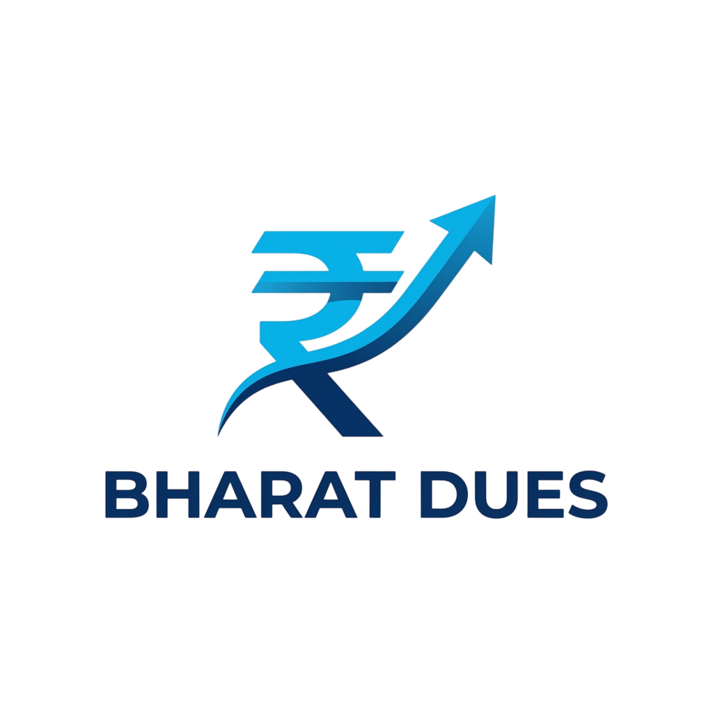
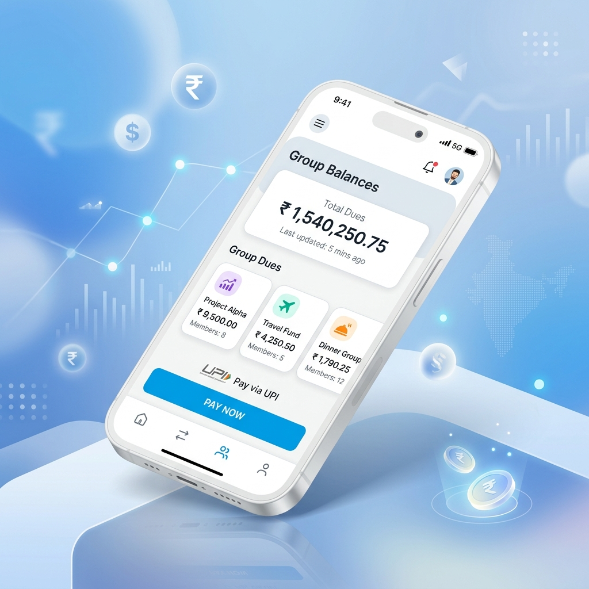
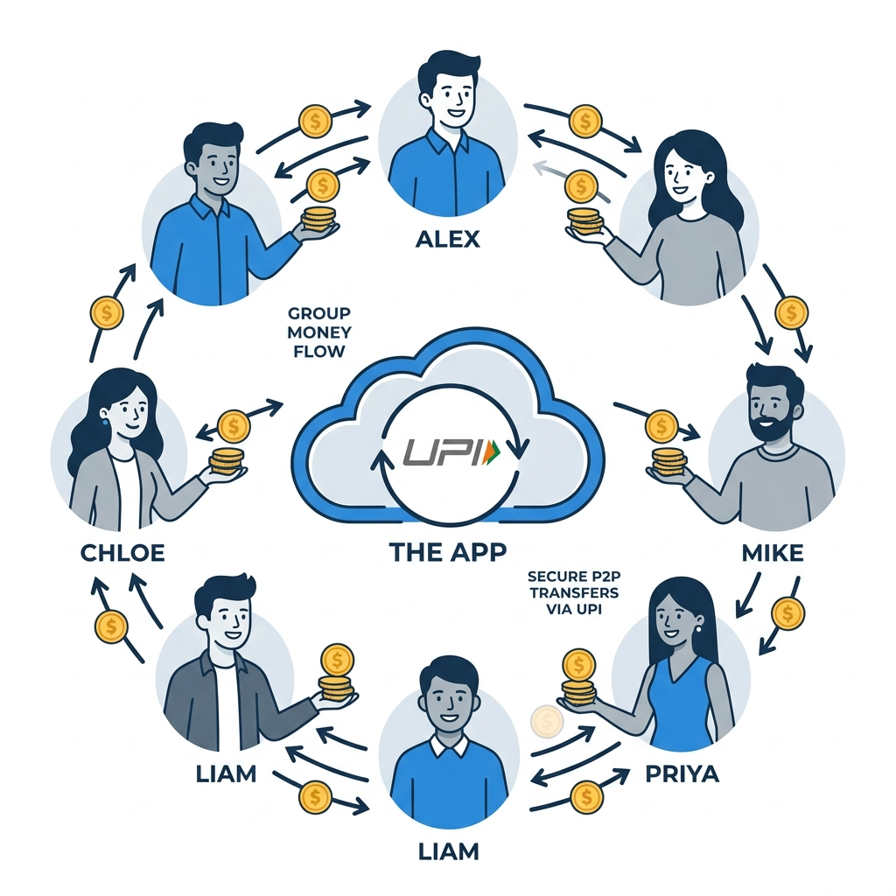
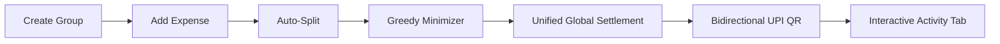

# Bharat Dues: Product Showcase

## 1. The Vision
### "Split Bills, Settle Beautifully."

Bharat Dues is a premium, **UPI-first** expense tracking solution designed for the modern Indian lifestyle. We bridge the gap between complex group spending and effortless digital settlements.

> [!TIP]
> **Key Objective**: Eliminating the "Who owes whom?" awkwardness through algorithmic debt minimization and direct UPI integration.

---

## 2. The Gap
### Why Bharat Dues?

| Solution | The Problem |
| :--- | :--- |
| **Traditional Apps** | Great for tracking, but require a "second dance" of switching to a payment app, typing amounts, and manually marking as paid. |
| **Native UPI Groups** | Great for payments, but lack sophisticated split-logic (%, unequal) and debt minimization for multi-expense trips. |
| **Bharat Dues** | **The Best of Both Worlds.** Tracks like a pro, minimizes transfers, and settles with a single tap via deep-linking. |

---

## 3. How It Works
### The Seamless Cycle of Settlement

```mermaid
graph LR
    A[Create Group] --> B[Add Expense]
    B --> C[Auto-Split]
    C --> D[Greedy Minimizer]
    D --> E[Unified Global Settlement]
    E --> F[Bidirectional UPI QR]
    F --> G[Interactive Activity Tab]
```

---

## 3. Core Features (The DNA)

| Feature | Description | Benefit |
| :--- | :--- | :--- |
| **Multi-Mode Splitting** | Equal, %, Shares, or Exact Amount | Flexibilty for every scenario |
| **Greedy Minimizer** | Sophisticated debt reduction algo | Fewer transactions, less hassle |
| **Real-Time Sync** | Firestore event-driven streams | Everyone stays on the same page |
| **Interactive Activity** | Inline confirmations & WhatsApp reminders | Faster settlements & transparency |
| **Unified Global Settlement** | Bidirectional UPI QR & Deep-linking | Pay or receive in 2 taps |
| **Identity Registries** | Cross-platform email/phone syncing | Rock-solid data integrity |

---

## 4. Design Philosophy
### Premium Fintech Aesthetics

The app features a **modern, high-contrast Light Theme** designed for the Indian digital ecosystem:

- **Vibrant Blue Accents** (`#00B9F1`): For clarity and trust.
- **Minimalist Surfaces**: Clean white cards on subtle grey backgrounds.
- **Standardized Terminology**: Clear "You owe" vs "You are owed" labels.
- **Web/PWA Optimized**: Seamless experience across mobile and desktop.
- **Settlement Scaling**: Reducing complexity from 10+ random transfers down to ~3 optimized ones using the Greedy Minimizer algorithm.

---

## 5. How to Use (3 Simple Steps)

1.  **Onboard**: Sign in with Google. Link your UPI ID in your profile.
2.  **Collaborate**: Create a group (Trip, Rent, Dinner) and add members via phone/email.
3.  **Settle**: Add expenses. The app calculates the **minimum number of transfers**. Tap "Pay" to settle via your favorite UPI app instantly.

---

## 6. Tech Stack & Trust

**Built on Rock-Solid Infrastructure:**
- **Frontend**: Flutter (High-performance Cross-platform & Web/PWA)
- **Backend**: Firebase Firestore (NoSQL Real-time)
- **Security**: Registry-based Identity (UID, Phone, and Email sync)
- **Precision**: Double-precision accounting with cent-based distribution.

---

### 📦 Key Summary for Presenting
Bharat Dues isn't just an expense tracker; it's a financial harmony tool. By combining a **premium UI** with **algorithmic intelligence** and **UPI integration**, we've created the fastest way to stay balanced with your friends and family.

**Developed by: [Shikhar Agarwal](https://www.linkedin.com/in/shikhar-agarwal-17jan2002/)**
